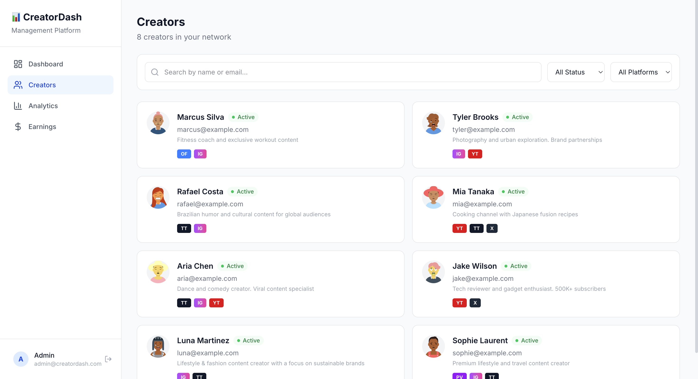
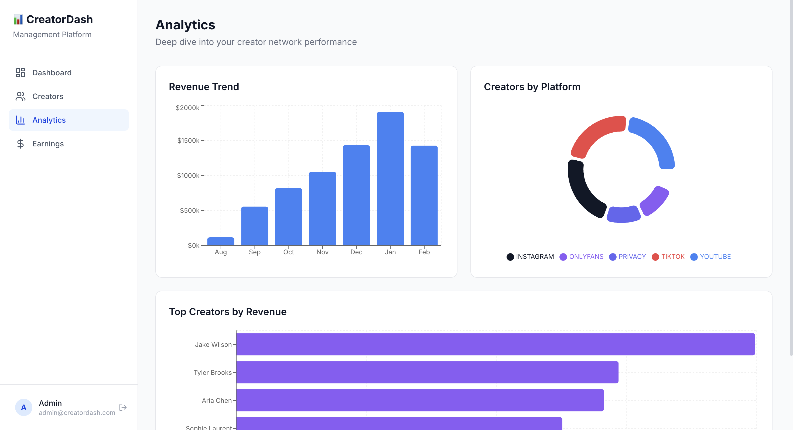
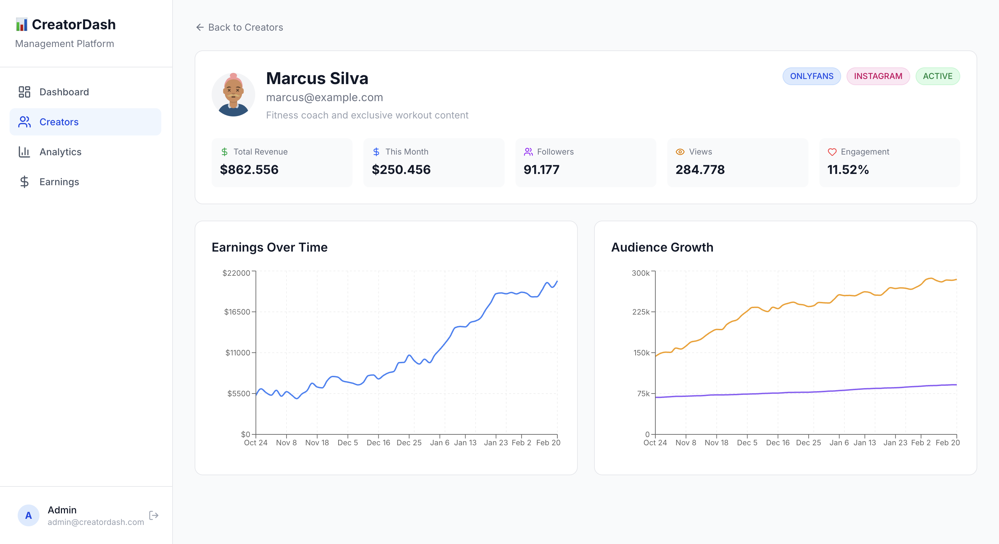
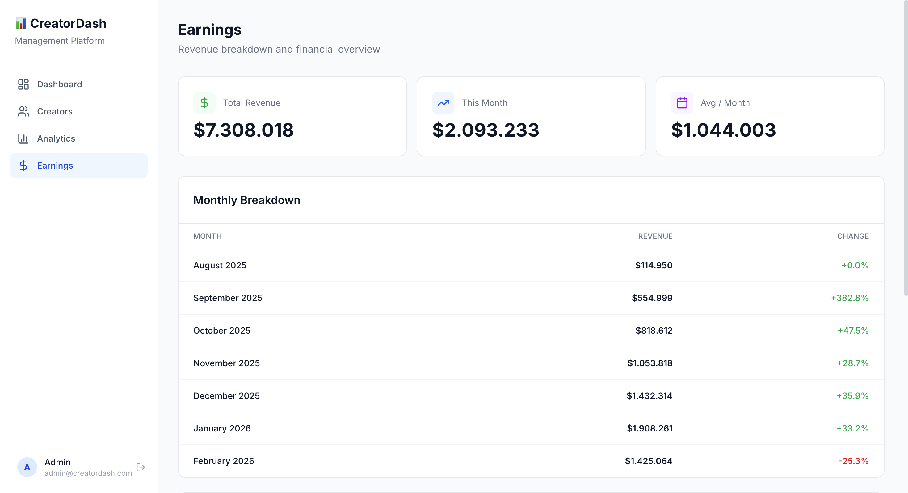

# 📊 Creator Analytics Dashboard

A full-stack analytics platform for managing content creators — tracking revenue, audience growth, and performance metrics across multiple platforms. Built with real-world experience from scaling a creator management agency.


## Why I Built This

I founded and scaled a content creator management agency from zero to $20,000+/month in revenue, managing multiple creators across platforms like OnlyFans, Instagram, and TikTok. This dashboard is a productized version of the analytics I used to run my business — rebuilt as a modern SaaS application.

## Features

- **Secure Authentication** — JWT-based login system with httpOnly cookies, protected routes, and session management
- **Revenue Analytics** — Track earnings over time with monthly breakdowns, growth percentages, and trend visualization
- **Creator Profiles** — Full profiles with auto-generated avatars, multi-platform support, bios, and individual performance charts
- **Audience Metrics** — Monitor followers, views, likes, and engagement rates per creator over time
- **Multi-Platform Support** — Creators can be linked to multiple platforms simultaneously (Instagram, YouTube, TikTok, OnlyFans, Privacy, Twitter)
- **Advanced Filtering** — Search creators by name/email, filter by platform and status with real-time results
- **Analytics Dashboard** — Revenue trends, platform distribution pie chart, and horizontal ranking of top performers
- **Financial Overview** — Monthly breakdown table with month-over-month change percentages and per-creator revenue bars
- **Fully Responsive** — Optimized layouts for desktop, tablet, and mobile with adaptive components

## Tech Stack

| Layer | Technology |
|-------|-----------|
| **Framework** | Next.js 15 (App Router) + TypeScript |
| **Database** | PostgreSQL + Prisma ORM |
| **Auth** | JWT (jose) + bcrypt password hashing + httpOnly cookies |
| **Charts** | Recharts (Bar, Line, Pie) |
| **Styling** | Tailwind CSS v4 |
| **Avatars** | DiceBear API (auto-generated) |
| **Infrastructure** | Docker, Vercel, Neon |

## Architecture

```
app/
├── api/
│   ├── auth/
│   │   ├── login/       # JWT authentication
│   │   ├── me/          # Session verification
│   │   └── logout/      # Session termination
│   ├── stats/           # Dashboard statistics
│   ├── creators/        # CRUD operations
│   ├── creators/[id]/   # Individual creator data
│   └── charts/          # Aggregated chart data
├── login/               # Login page (standalone layout)
├── creators/            # Creator listing (card grid)
├── creators/[id]/       # Creator detail with charts
├── analytics/           # Analytics dashboard
├── earnings/            # Revenue breakdown
└── page.tsx             # Main dashboard
components/
├── auth-provider.tsx    # Authentication context
├── app-shell.tsx        # Conditional layout (auth-aware)
├── sidebar.tsx          # Navigation with logout
├── mobile-header.tsx    # Responsive navigation
├── stats-cards.tsx      # Dashboard KPI cards
└── revenue-chart.tsx    # Revenue visualization
lib/
└── prisma.ts            # Database client singleton
```

## Screenshots

| Dashboard | Creators | Analytics |
|-----------|----------|-----------|
|  |  |  |

| Login | Creator Detail | Earnings |
|-------|---------------|----------|
|  |  |  |

## Getting Started

### Prerequisites
- Node.js 18+
- Docker
- Git

### Setup

1. Clone and install:
```bash
git clone https://github.com/yamatadev/creator-dashboard.git
cd creator-dashboard
npm install
```

2. Start the database:
```bash
docker compose up -d
```

3. Configure environment:
```bash
cp .env.example .env
```

4. Run migrations and seed:
```bash
npx prisma migrate dev
npx prisma db seed
```

5. Start the dev server:
```bash
npm run dev
```

Open http://localhost:3000

**Login:** admin@creatordash.com / admin123

## Technical Decisions

- **Next.js App Router** over Pages Router for server components and cleaner data fetching patterns
- **JWT with httpOnly cookies** over NextAuth for lighter auth without third-party dependencies
- **Prisma ORM** for type-safe queries, automatic migrations, and excellent DX
- **Recharts** over Chart.js for native React composition and better component integration
- **DiceBear avatars** over file uploads for zero-storage avatar generation in a demo context
- **Card-based mobile layout** over tables for responsive data display without horizontal scrolling
- **PostgreSQL array fields** for multi-platform creator support without a join table

## License

MIT
