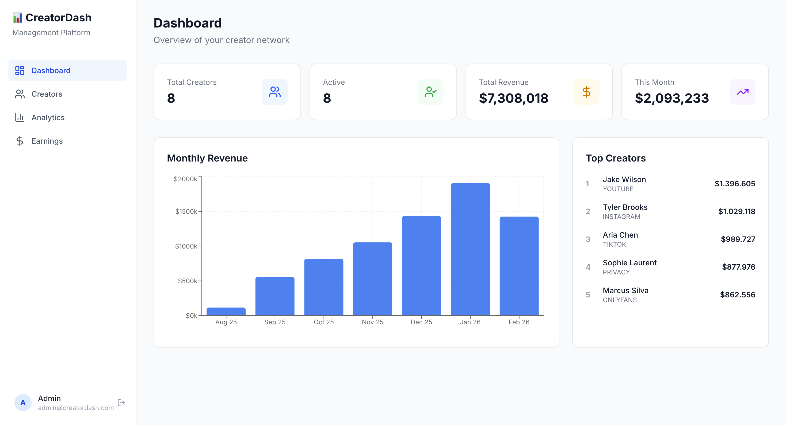

# 📊 Creator Analytics Dashboard

A full-stack analytics platform for managing content creators — tracking revenue, audience growth, and performance metrics across multiple platforms.



## Why I Built This

I founded and scaled a content creator management agency from zero to $20,000+/month in revenue, managing multiple creators across platforms like OnlyFans, Instagram, and TikTok. This dashboard is a productized version of the analytics I used to run my business — rebuilt as a modern SaaS application.

## Features

- **Revenue Analytics** — Track earnings over time with monthly breakdowns and growth trends
- **Creator Profiles** — Full profiles with bio, platform, status, and individual performance charts
- **Audience Metrics** — Monitor followers, views, likes, and engagement rates per creator
- **Multi-Platform Support** — Instagram, YouTube, TikTok, OnlyFans, Privacy
- **Smart Filtering** — Search creators by name, filter by platform and status
- **Responsive Design** — Works seamlessly on desktop, tablet, and mobile

## Tech Stack

- **Framework:** Next.js 15 (App Router) + TypeScript
- **Database:** PostgreSQL + Prisma ORM
- **Charts:** Recharts
- **Styling:** Tailwind CSS v4
- **Auth:** JWT with bcrypt password hashing
- **Infrastructure:** Docker, Vercel, Neon

## Architecture

src/
├── app/
│   ├── api/              # REST API routes
│   │   ├── stats/        # Dashboard statistics
│   │   ├── creators/     # CRUD operations
│   │   ├── creators/[id] # Individual creator data
│   │   └── charts/       # Chart aggregations
│   ├── creators/         # Creator listing
│   ├── creators/[id]     # Creator detail page
│   ├── analytics/        # Analytics dashboard
│   ├── earnings/         # Revenue breakdown
│   └── page.tsx          # Main dashboard
├── components/           # Reusable React components
└── lib/
└── prisma.ts         # Database client

## Getting Started

### Prerequisites
- Node.js 18+
- Docker
- Git

### Setup

1. Clone and install:
```bash
git clone https://github.com/YOUR_USERNAME/creator-dashboard.git
cd creator-dashboard
npm install
```

2. Start the database:
```bash
docker compose up -d
```

3. Configure environment:
```bash
cp .env.example .env
```

4. Run migrations and seed data:
```bash
npx prisma migrate dev
npx prisma db seed
```

5. Start the dev server:
```bash
npm run dev
```

Open http://localhost:3000. Login: admin@creatordash.com / admin123

## Technical Decisions

- **Next.js App Router** for server components and efficient data fetching
- **Prisma ORM** for type-safe database operations and easy migrations
- **Recharts** over Chart.js for better React integration and composability
- **Tailwind CSS** for rapid, consistent styling without CSS files
- **PostgreSQL** over MySQL for better JSON support and advanced aggregation queries

## License

MIT